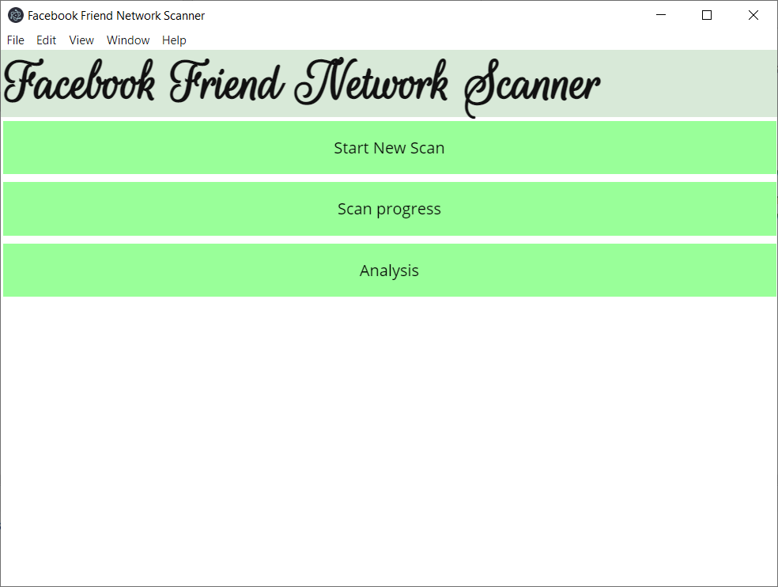
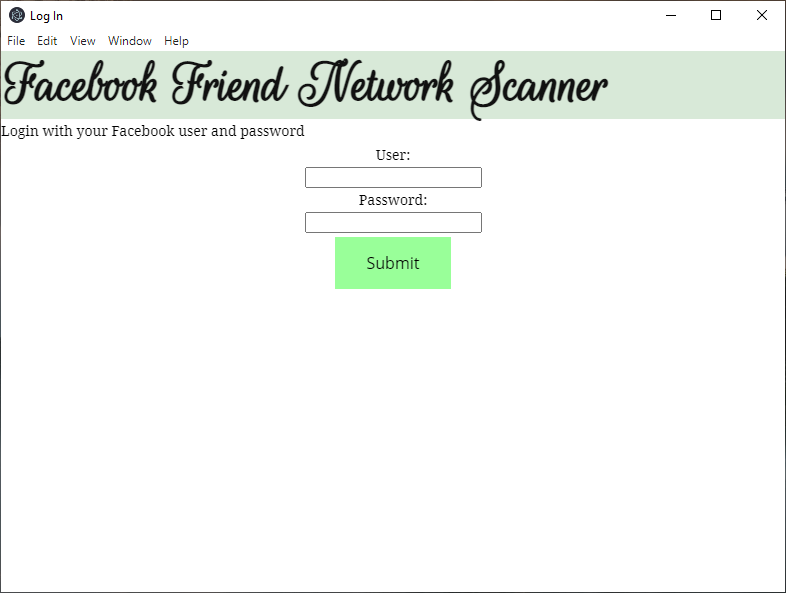
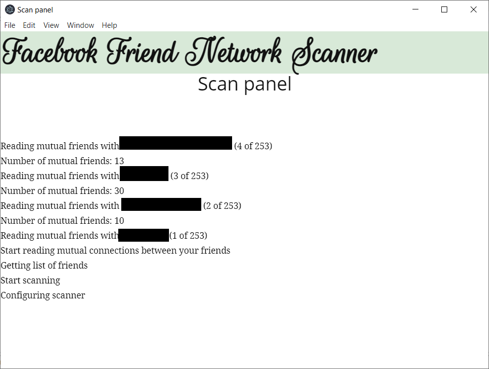
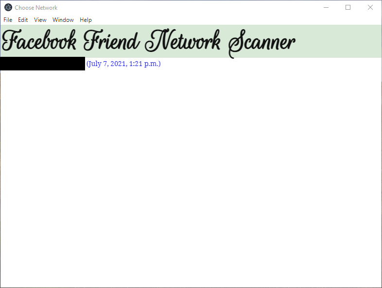
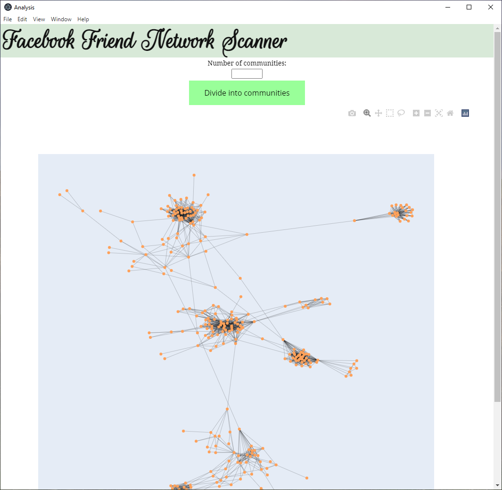

Author: Rubén Chuliá Mena <rubchume@gmail.com>

This web app uses Django and Electron to make it easy to scan the your Facebook network and visualize it with Plotly.

Refer to this [article](https://www.listeningtothedata.com/posts/read-your-network-of-friends-in-facebook-by-scraping-with-python/) and this [article](https://www.listeningtothedata.com/posts/organize-your-wedding-with-social-network-analysis-in-python/) to understand what this app does.

The welcome page has three buttons:

You can press the header "Facebook Friend Network Scanner" to come back to the main page at any moment.

Press "Start New Scan" to start the scan of your network. You will be required to enter your Facebook user and password.
However, the password will not be stored in any way in the database or in any file.


Once you press submit, you will be redirected to the "Scan progress page".

It will only scan the friends of yours that are officially active in Facebook (that did not deactivate their account).
However, if you suspect the app missed some of your friends, which sometimes happens (it is a bug that currently exists), just close the app and start a new scan again.

When it's finished, you can press the third button from the main page: "Analysis".
There you can select the scan instance. If you only used it for one Facebook account, there will be only one possibility:


Wait for the network to be processed and then you will see an interactive visualization:


Finally, you can use the [Fluid Communities algorithm](https://networkx.org/documentation/stable/reference/algorithms/generated/networkx.algorithms.community.asyn_fluid.asyn_fluidc.html#networkx.algorithms.community.asyn_fluid.asyn_fluidc) to divide the network into communities:


**NOTE**
 
Beware Facebook changes its web and API often, so this web app will very likely stop working soon. However, you can take the current code and update it so it works again.

Check out the previously mentioned [article](https://www.listeningtothedata.com/posts/read-your-network-of-friends-in-facebook-by-scraping-with-python/) in order to find out how you can do it.   

# Installation of packages
The application needs to be executed in an environment with Python 3.8 installed.

If this is the case, proceed with the installation of necessary packages. Open the CLI (Command Line Interface) and execute:
```bash
pip install -r requirements.txt
```

# Execution
```
npm start
```

Or, if you don't have npm available, use
```
start_analyzer.sh
```
and visit http://127.0.0.1:8000/.

# Test
Test the application with Pytest using
```bash
python -m pytest
```
